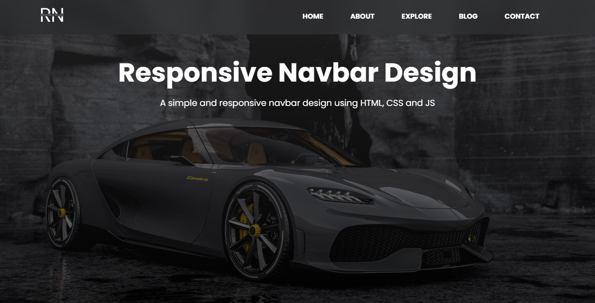
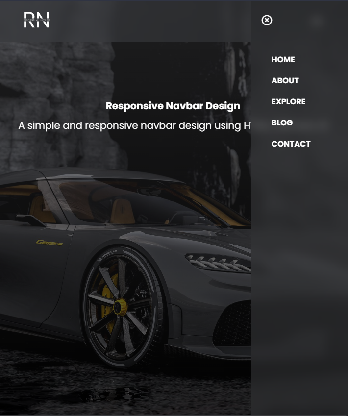

# responsive_navbar_design

A simple responsive Navbar design using HTML, CSS and JavaScript x Smoking Animation

## Desktop View

	

### > Responsive Navbar Design using HTML, CSS and JS

### > Smoking Animation in the Navbar

### > Responsive Animation

 

## Mobile View

	

### > Responsive navbar that can be used in any website

# Thank you for visiting :)
